 **About Keyestudio**

Keyestudio is a best-selling brand owned by KEYES Corporation. Our product contains Arduino development boards, expansion boards, sensors and modules, Raspberry Pi, micro: bit expansion boards as well as smart cars, which can help customers at any level to learn about Arduino.

Notably, all of our products are in line with international quality standards and are greatly appreciated in a broad menu of different markets across the world.

Welcome to check out more contents from our official website: [http://www.keyestudio.com](http://www.keyestudio.com)

 **Obtain Information and After-sales Service**

1. Download address: [https://fs.keyestudio.com/FKS0002](https://fs.keyestudio.com/FKS0002)
2. If something is found missing or broken, or you have some difficulty learning the kit, please feel free to contact us. Welcome to send email to us: **service@keyestudio.com**
3. We will endeavor to update projects and products continuously from your sincere advice! Thanks!

 **Warning**

1. This product contains tiny parts(screws and copper pillars), so please keep out of reach of children to prevent from lacerations or accidental ingestion. For children under 8, please accompany with adults when using.
2. This product contains conductive parts(control board and electronic modules). Please operate according to the requirements of tutorials. Otherwise, improper operation may damage parts due to overheating. In this case, do not touch and immediately disconnect the circuit power.

 **Copyright**

The keyestudio trademark and logo are the copyright of KEYES DIY ROBOT co.,LTD. All products under Keyestudio brand can’t be copied, sold or resold without authorization by anyone or company.

If you are interested in our products, please contact to our sales representatives: fennie@keyestudio.com

# **NANO Inventor Starter Kit**

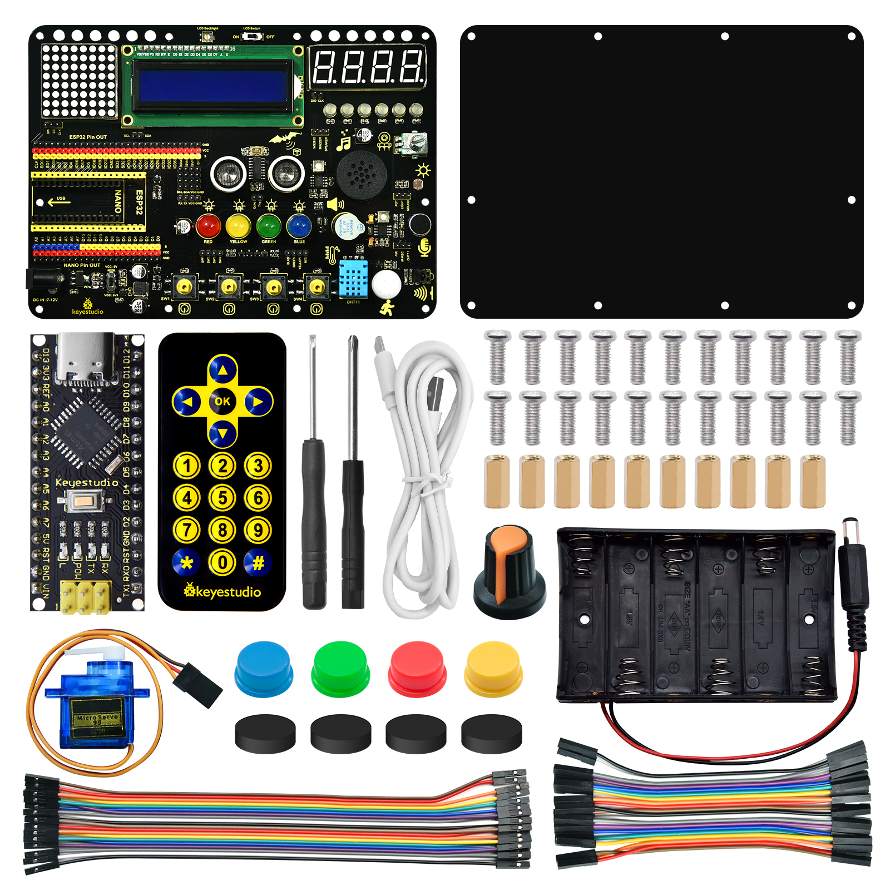

# **Description**

This starter kit is a programmable tool specialized for kids above 6.

In total, we provide 15 modules and sensors(such as LED, buttons, LCD, photosensor, sound sensor, IR remote, temperature and humidity sensor) as well as 30 projects(like mini lamp, counter, responder, timebomb and meteorological station), in which you will enjoy spending your day.

For each project, we offer you two programming language: Arduino C and graphical programming on the basis of KidsBlock Desktop, which is beneficial to cultivate preliminary programming logic.

# **Features**

**1. Easy wiring:** The wiring of VCC and GND are removed, so there is no need to worry about burning sensors and modules.

**2. Multiple functions:** Nano/ESP32 development board are both available as the control board; 15 sensors are integrated; The VCC of 3.3V/5V can be adjusted via DIP switch when connecting to external power supply.

**3. Simple structure:** With 6mm dual-pass copper pillars and acrylic boards, the installation is convenient meanwhile it avoids you being scratched by welding points.

**4. High expansibility:** Though in-built VCC is provided on modules in this kit, lead-out pins of VCC and GND are reserved to expand for external modules.

**5. Underlying code learning:** In view of green hands, graphical programming is used to cultivate programming logic and build foundation. Considering of well-grounded persons, C language is used combining with hardware working principles to know deeper on underlying code. 

# **Parameters**

- **Working voltage:** 5V / 3.3V
- **DC power supply:** 7-12V

- **USB power supply:**  5V
- **Working current:** ≥35mA

- **Working temperature:** –10°C ~ +65°C

# **Kit List**

| N.O. | PIC | NAME | QNT |
| :-: | :-: | :-: | :-: |
| 1    |  | Keyestudio Expansion Board | 1    |
| 2    | 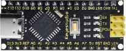                                 | Keyestudio Development Board | 1    |
| 3    | 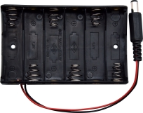                                 | Battery Holder with DC Connector | 1    |
| 4    | 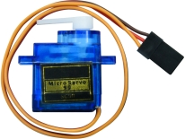                                 | Servo               | 1    |
| 5    | 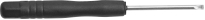                                 | Slotted Screwdriver | 1    |
| 6    |                                  |         Phillips Screwdriver         | 1    |
| 7    | 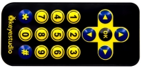 |         IR Remote Control          | 1    |
| 8    | 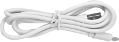                                 | Type-c USB Cable     | 1    |
| 9    |  | M2.5*6MM Round-headed Screw | 22   |
| 10   | 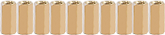                                           | M2.5*9MM Dual-pass Copper Pillar | 10   |
| 11   | 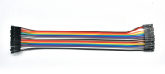                                    | F-F 20cm DuPont Wires | 20   |
| 12   | 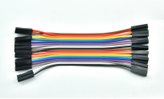                                    | F-F 10cm DuPont Wires | 20   |
| 13   |                                 | Acrylic Board | 1    |
| 14 |  | Rubber Pad | 4 |
| 15 | 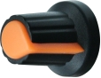 | Rotary Button | 1 |
| 16 | 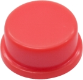 | Red Button Cap | 1 |
| 17 |  |          Green Button Cap          | 1 |
| 18 | 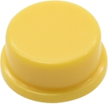 |         Yellow Button Cap          | 1 |
| 19 |  |          Blue Button Cap           | 1 |

